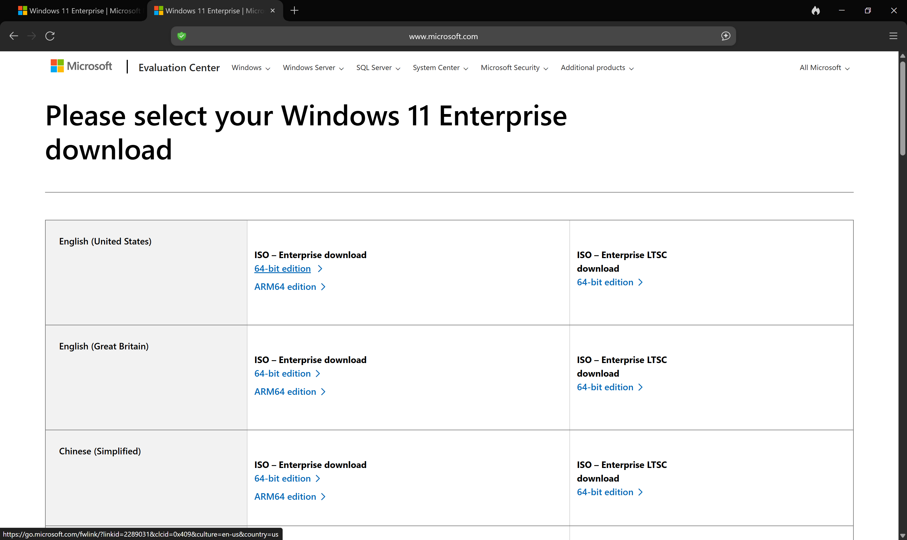
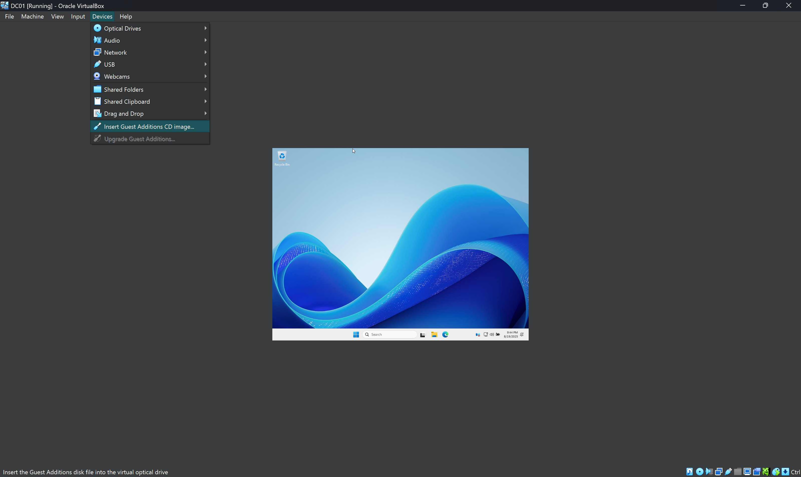
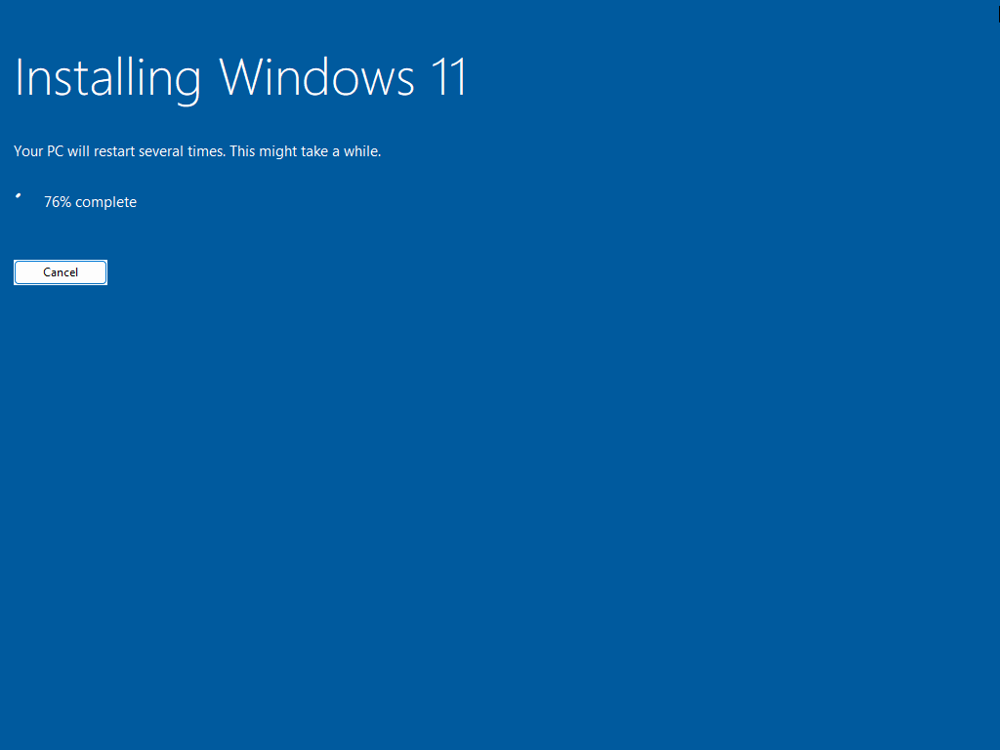
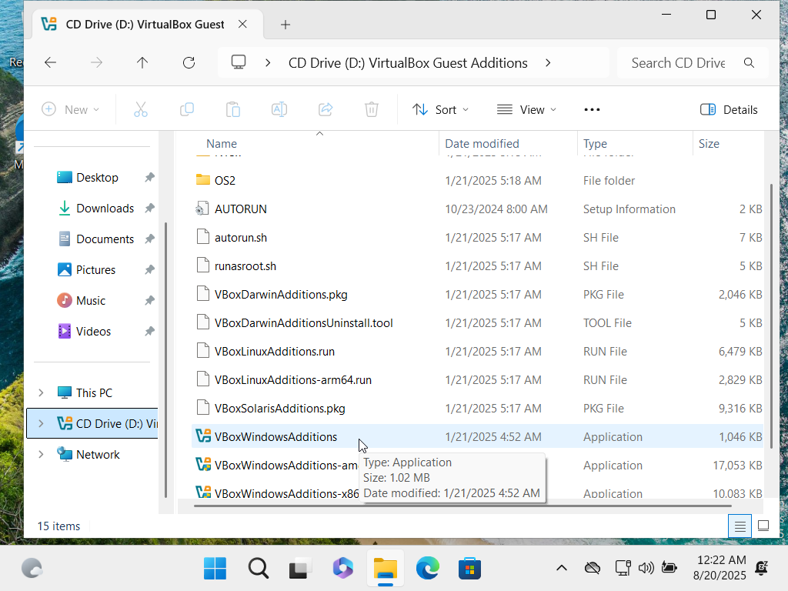

# 📐 AD Home Lab — Full Setup Guide (VirtualBox Edition)

🎯 **Goal:** Build a complete Active Directory lab using **VirtualBox**, **Windows Server 2025**, and **Windows 11**.  
This walkthrough has **110+ screenshots** and explains each step clearly so even beginners can follow along.

---

## 🗂️ Table of Contents

- [📦 Part 1 — Prerequisites: Downloads & Installers](#part-1--prerequisites-downloads--installers)  
- [🖥️ Part 2 — Create the Domain Controller (DC01)](#part-2--create-the-domain-controller-dc01)  
  - [🛠️ VM Setup](#step-9--virtualbox-ready)  
- [💽 Part 3 — Install Windows Server 2025](#part-3--install-windows-server-2025)  
- [⚙️ Part 4 — Configure DC01: Rename, Networking, and Add AD DS Role](#part-4--configure-dc01-rename-networking-and-add-ad-ds-role)  
- [🏰 Part 5 — Promote DC01 to a Domain Controller](#part-5--promote-dc01-to-a-domain-controller)  
- [💻 Part 7 — Create and Configure CLIENT01 (Windows 11)](#part-7--create-and-configure-client01-windows-11)  
- [💽 Part 8 — Install Windows 11 on CLIENT01](#part-8--install-windows-11-on-client01)  
- [🔧 Part 9 — Install Guest Additions on CLIENT01](#part-9--install-guest-additions-on-client01)  
- [🌐 Part 10 — Configure CLIENT01 Networking & Join Domain](#part-10--configure-client01-networking--join-domain)  
- [✅ Part 11 — Verify CLIENT01 in Active Directory](#part-11--verify-client01-in-active-directory)  
- [📐 Blueprint Complete](#-blueprint-complete)

---

## <h2 id="part-1--prerequisites-downloads--installers"> 📦 Part 1 — Prerequisites: Downloads & Installers </h2>

### Step 1 — Download VirtualBox
Go to virtualbox.org and open the **Downloads** page. Choose the installer for **Windows Hosts**.

### Step 2 — Download the Extension Pack
Download the **VirtualBox Extension Pack** (adds USB and networking features).

### Step 3 — Begin Windows Server Download
On Microsoft’s site, hover/select the **Windows Server ISO** download option.

### Step 4 — Fill Out Microsoft Form
Complete the short form to proceed to the ISO download.

### Step 5 — Select Windows Server 64‑bit ISO
Pick the **64‑bit ISO** and save it (e.g., `C:\ISOs\`).

### Step 6 — Windows 11 Enterprise Download
Open Microsoft’s Windows 11 Enterprise page and select the ISO download.

### Step 7 — Form for Windows 11
Fill the required info to access the ISO.

### Step 8 — Choose Windows 11 ISO (64‑bit)
Select the **64‑bit ISO** and save it alongside the server ISO.

[🔝 Back to Top](#-table-of-contents)

---

## <h2 id="part-2--create-the-domain-controller-dc01"> 🖥️ Part 2 — Create the Domain Controller (DC01) </h2>

### Step 9 — VirtualBox Ready
Open **Oracle VirtualBox Manager** (blank canvas).

### Step 10 — Create New VM: DC01
**Machine → New**. Configure: Name `DC01`, attach Server 2025 ISO, Type Microsoft Windows, Version Windows Server 2022 (64‑bit), and check **Skip Unattended Installation**.

### Step 11 — VM Wizard: Hardware
Assign: **Base Memory** minimum **4 GB** (we used **8 GB**); **Processors**: **2 CPUs**.

### Step 12 — VM Wizard: Hard Disk
**Create a Virtual Hard Disk now**. **Size**: minimum **50 GB** (we used **80 GB** for headroom). Click **Finish**.

[🔝 Back to Top](#-table-of-contents)

---

## <h2 id="part-3--install-windows-server-2025"> 💽 Part 3 — Install Windows Server 2025 </h2>

### Step 13 — Language Selection
Choose language/time/keyboard → **Next**.

### Step 14 — Keyboard Layout
Confirm keyboard layout → **Next**.

### Step 15 — Install Windows Server
Click **Install Now**.

### Step 16 — Choose Image
Select **Windows Server 2025 Evaluation (Desktop Experience)**.

### Step 17 — Accept License Terms
Check the agreement → **Next**.

### Step 18 — Disk Selection
Select **Disk 0 (80 GB)** → **Next**.

### Step 19 — Ready to Install
Confirm and start installation.

### Step 20 — Administrator Password
Set a strong password for **Administrator**.

### Step 21 — Send Ctrl+Alt+Del
Use **Input → Keyboard → Insert Ctrl+Alt+Del** to sign in.

### Step 22 — Diagnostic Settings
Select the required option → **Next**.

### Step 23 — Insert Guest Additions
**Devices → Insert Guest Additions CD Image**.

### Step 24 — Open File Explorer
Open File Explorer to access the CD.

### Step 25 — Run VBoxWindowsAdditions
Start the Guest Additions installer.

### Step 26 — Guest Additions Wizard (Next)
Click **Next**.

### Step 27 — Installation Path
Accept defaults → **Next**.

### Step 28 — Choose Components
Leave defaults → **Next**.

### Step 29 — Finish Installation
Select **I want to manually reboot later** → **Finish**.

[🔝 Back to Top](#-table-of-contents)

---

## <h2 id="part-4--configure-dc01-rename-networking-and-add-ad-ds-role"> ⚙️ Part 4 — Configure DC01: Rename, Networking, and Add AD DS Role </h2>

### Step 30 — View Your PC Name
Search **View your PC name**.

### Step 31 — System → About
Click **Rename this PC**.

### Step 32 — Rename to DC01
Enter `DC01` → **Next**.

### Step 33 — Restart Now
Restart to apply rename.

### Step 34 — Continue
Choose reason, click **Continue**.

### Step 35 — Open Network Manager
VirtualBox **File → Tools → Network Manager**.

### Step 36 — Create NAT Network
Create `AD_HOME_LAB` (e.g., `10.0.2.0/24`, DHCP enabled) → **Apply**.

### Step 37 — VM Settings
**Machine → Settings** for DC01.

### Step 38 — Adapter 1
Set **Adapter 1** to **NAT Network**.

### Step 39 — Attach AD_HOME_LAB
Attach Adapter 1 → **AD_HOME_LAB**.

### Step 40 — Add Roles and Features
On DC01, **Server Manager → Manage → Add Roles and Features**.

### Step 41 — Before You Begin
Click **Next**.

### Step 42 — Installation Type
Select **Role-based or feature-based installation** → **Next**.

### Step 43 — Server Selection
Keep local server → **Next**.

### Step 44 — Select AD DS
Check **Active Directory Domain Services**.

### Step 45 — Add Features
Click **Add Features**.

### Step 46 — AD DS Checked
Confirm AD DS checked → **Next**.

### Step 47 — Features
Leave defaults → **Next**.

### Step 48 — AD DS Info
Review → **Next**.

### Step 49 — Confirmation
Click **Install**.

### Step 50 — Promote to DC
Click **Promote this server to a domain controller**.

[🔝 Back to Top](#-table-of-contents)

---

## <h2 id="part-5--promote-dc01-to-a-domain-controller"> 🏰 Part 5 — Promote DC01 to a Domain Controller </h2>

### Step 51 — Add a New Forest
Enter root domain: `ToonWrld.local` → **Next**.

### Step 52 — Domain Controller Options
Set **DSRM** password → **Next**.

### Step 53 — DNS Options
Leave defaults → **Next**.

### Step 54 — Additional Options
NetBIOS name auto-set to **TOONWRLD** → **Next**.

### Step 55 — Paths
Accept defaults → **Next**.

### Step 56 — Review Options
Review and continue → **Next**.

### Step 57 — Prerequisites Check
Pass → **Install**.

### Step 58 — Applying Computer Settings
Wait for configuration to complete.

### Step 59 — First Domain Login
Log in as `TOONWRLD\Administrator`.

### Step 60 — Open ADUC
**Server Manager → Tools → Active Directory Users and Computers**.

### Step 61 — Verify DC01 in ADUC
Confirm `DC01` is listed under **Computers**.

[🔝 Back to Top](#-table-of-contents)

---

## <h2 id="part-7--create-and-configure-client01-windows-11"> 💻 Part 7 — Create and Configure CLIENT01 (Windows 11) </h2>

### Step 62 — Create New VM
**Machine → New** to start creating the client VM.

### Step 63 — VM Wizard: Basic Settings
Name `CLIENT01`, attach Windows 11 ISO, Version Windows 11 (64‑bit), **Skip Unattended Installation**.

### Step 64 — VM Wizard: Hardware
Assign **8 GB RAM** (min 4 GB) and **2 CPUs**.

### Step 65 — VM Wizard: Hard Disk
Create VHD now, **50–80 GB** → **Finish**.

### Step 66 — VM Settings: Network
**Settings → Network**, set Adapter 1 → **NAT Network**.

### Step 67 — Attach to AD_HOME_LAB
Confirm NAT Network: **AD_HOME_LAB**.

[🔝 Back to Top](#-table-of-contents)

---

## <h2 id="part-8--install-windows-11-on-client01"> 💽 Part 8 — Install Windows 11 on CLIENT01 </h2>

### Step 68 — Language Selection
Choose language → **Next**.

### Step 69 — Keyboard Layout
Choose keyboard → **Next**.

### Step 70 — Install Windows 11
Click **Install now**, accept agreement.

### Step 71 — License Terms
Accept and continue.

### Step 72 — Disk Selection
Pick **Disk 0 (80 GB)** → **Next**.

### Step 73 — Ready to Install
Confirm → **Install**.

### Step 74 — Installing Windows 11
Wait while Windows installs.

### Step 75 — Country/Region
Select your country → **Yes**.

### Step 76 — Keyboard Layout
Confirm keyboard → **Yes**.

### Step 77 — Add Second Keyboard
Click **Skip**.

### Step 78 — Sign‑in Options
Click **Sign‑in options**.

### Step 79 — Domain Join Instead
Choose **Domain join instead** to create a local user.

### Step 80 — Create Local User
Enter username (e.g., `Temp`) → **Next**.

### Step 81 — Set Password
Create/confirm password → **Next**.

### Step 82 — Security Questions
Add three security questions → **Next**.

### Step 83 — Privacy Settings
Disable optional settings → **Accept**.

### Step 84 — Updates in Progress
Let Windows finish setup.

### Step 85 — Log In (Temp)
Select `Temp`, enter password, sign in.

[🔝 Back to Top](#-table-of-contents)

---

## <h2 id="part-9--install-guest-additions-on-client01"> 🔧 Part 9 — Install Guest Additions on CLIENT01 </h2>

### Step 86 — Insert Guest Additions
**Devices → Insert Guest Additions CD image**.

### Step 87 — Open File Explorer
Open File Explorer to access the CD.

### Step 88 — Locate Installer
Select **VBoxWindowsAdditions**.

### Step 89 — Allow Changes
Click **Yes** to allow.

### Step 90 — Wizard Start
Click **Next**.

### Step 91 — Install Location
Accept defaults → **Next**.

### Step 92 — Choose Components
Leave defaults → **Install**.

### Step 93 — Finish and Reboot
Select **Reboot now** → **Finish**.

[🔝 Back to Top](#-table-of-contents)

---

## <h2 id="part-10--configure-client01-networking--join-domain"> 🌐 Part 10 — Configure CLIENT01 Networking & Join Domain </h2>

### Step 94 — Open Network Connections
Search **View network connections** → open.

### Step 95 — Ethernet Properties
Right‑click Ethernet → **Properties**.

### Step 96 — IPv4 Settings
Double‑click **Internet Protocol Version 4 (TCP/IPv4)**.

### Step 97 — Open Command Prompt on DC01
On DC01, open **Command Prompt**.

### Step 98 — Note DC01 IPv4
Run `ipconfig`. Note **IPv4** (e.g., `10.0.2.15`). This will be the client’s DNS.

### Step 99 — Set DNS to DC01
Back on CLIENT01, set DNS to **10.0.2.15** → **OK**.

### Step 100 — Open Run
Search **Run** → open.

### Step 101 — System Properties
Type `sysdm.cpl` → **OK**.

### Step 102 — Change Domain Membership
Click **Change**.

### Step 103 — Join TOONWRLD.local
Computer Name: `CLIENT01` | Domain: `TOONWRLD.local` → **OK**.

### Step 104 — Provide Domain Credentials
Enter domain admin (`Administrator`) + password → **OK**.

### Step 105 — Domain Join Success
“Welcome to the TOONWRLD.local domain” → **OK**.

### Step 106 — Restart Required
Restart is required → **OK**.

### Step 107 — Confirm Restart
Close System Properties.

### Step 108 — Restart Now
Click **Restart Now**.

[🔝 Back to Top](#-table-of-contents)

---

## <h2 id="part-11--verify-client01-in-active-directory"> ✅ Part 11 — Verify CLIENT01 in Active Directory </h2>

### Step 109 — Open ADUC on DC01
**Server Manager → Tools → Active Directory Users and Computers**.

### Step 110 — Confirm CLIENT01 Object
In **ToonWrld.local → Computers**, confirm `CLIENT01` exists.

---

# 📐 Blueprint Complete

You now have a working Active Directory environment:
- **DC01** promoted as a domain controller for `TOONWRLD.local`
- **CLIENT01** joined to the domain and visible in ADUC

📐 **Blueprint complete. Your turn to build.**
