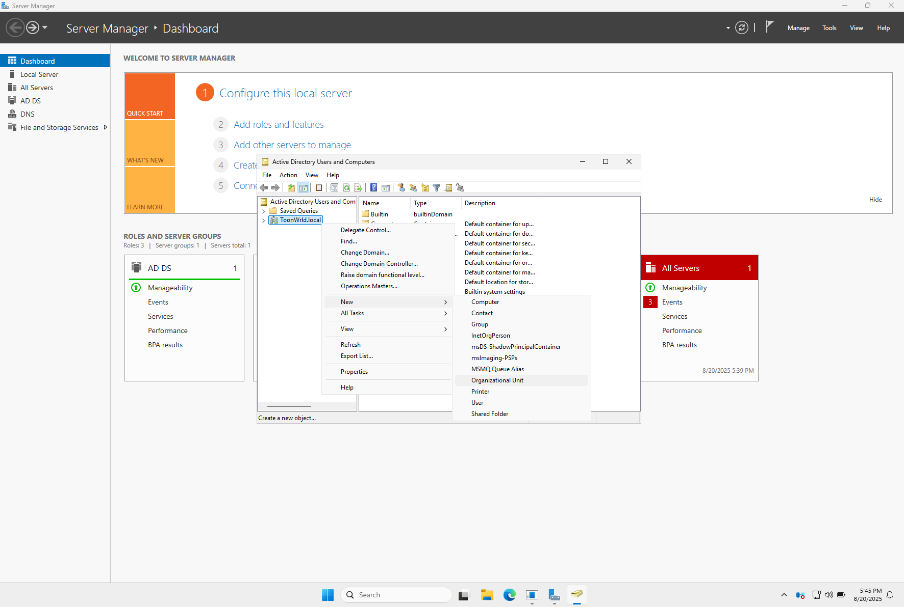
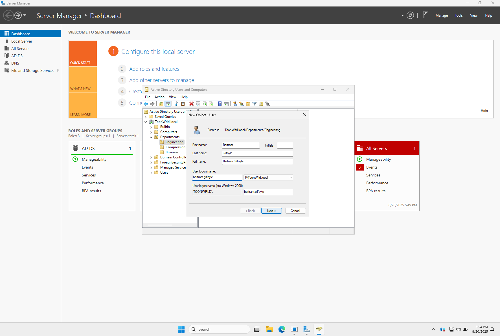

# 📖 Active Directory Admin Playbook (Pied Piper Edition)

This playbook documents essential Active Directory admin tasks inside your **Pied Piper Lab**.  
All steps are paired with screenshots for a beginner-friendly, “dummy proof” walkthrough.  

---

## 📜 Table of Contents

- [📁 Step 1. Create Organizational Units (OUs)](#-step-1-create-organizational-units-ous)
- [👤 Step 2. Create User Accounts](#-step-2-create-user-accounts)
- [👥 Step 3. Create Security Groups](#-step-3-create-security-groups)
- [🔗 Step 4. Add Users to Groups](#-step-4-add-users-to-groups)
- [🖥️ Step 5. Move CLIENT01 into the Correct OU](#-step-5-move-client01-into-the-correct-ou)
- [🧰 Step 6. Reset a User Password](#-step-6-reset-a-user-password)
- [🧱 Step 7. Create and Link a GPO (Pied Piper Banner)](#-step-7-create-and-link-a-gpo-pied-piper-banner)
- [🧪 Step 8. Push and Test the GPO](#-step-8-push-and-test-the-gpo)
- [📦 Wrapping Up](#-wrapping-up)

---

## 📁 Step 1. Create Organizational Units (OUs)

1. Open **Server Manager** → **Tools** → hover over **Active Directory Users and Computers (ADUC)**.  
   

2. In **ADUC**, right-click `ToonWrld.local` → hover over **New > Organizational Unit**.  
   

3. Create a top-level OU named **Departments**.  
   - “Protect container from accidental deletion” left checked.  
   

4. Right-click **Departments** → hover over **New > Organizational Unit**.  
   

5. Create a child OU named **Engineering**.  
   

6. Create a child OU named **Compression**.  
   

7. Create a child OU named **Business**.  
   

---

## 👤 Step 2. Create User Accounts

8. Right-click the **Engineering OU** → hover over **New > User**.  
   

9. Create **Bertram Gilfoyle** (`bertram.gilfoyle@ToonWrld.local`).  
   

10. Assign a password for Gilfoyle.  
   - “User must change password at next logon” checked.  
   

11. Confirm Gilfoyle’s account creation.  
   

12. Create **Dinesh Chugtai** (`dinesh.chugtai@ToonWrld.local`).  
   

13. Assign a password for Dinesh.  
   

14. Confirm Dinesh’s account creation.  
   

15. Create **Richard Hendricks** (`richard.hendricks@ToonWrld.local`) in the **Compression OU**.  
   

16. Create **Jared Dunn** (`jared.dunn@ToonWrld.local`) in the **Business OU**.  
   

---

## 👥 Step 3. Create Security Groups

17. Engineering OU with Bertram and Dinesh listed. Right-click **Engineering** → **New > Group**.  
   

18. Create group named **Engineers**.  
   

19. In **Compression OU**, right-click → **New > Group**.  
   

20. Create group named **CompressionTeam**.  
   

21. In **Business OU**, create group **BizOps**.  
   

---

## 🔗 Step 4. Add Users to Groups

22. In **Engineering OU**, right-click **Dinesh Chugtai** → **Add to a group**.  
   

23. In “Select Groups” dialog, type `Engi` → click **Check Names**.  
   

24. Auto-completes to **Engineers** group → click OK.  
   

25. Confirmation message shows **Dinesh added successfully**.  
   

26. In **Compression OU**, right-click **Richard Hendricks** → **Add to a group**.  
   

27. In “Select Groups,” type `Comp` → click **Check Names**.  
   

28. Auto-completes to **CompressionTeam** group → click OK.  
   

29. Confirmation message shows **Richard added successfully**.  
   

30. In **Business OU**, add **Jared Dunn** → auto-completes to **BizOps** group → click OK.  
   

---

## 🖥️ Step 5. Move CLIENT01 into the Correct OU

31. In **ADUC**, open the **Computers** container and select **CLIENT01**.  
   

32. Right-click **CLIENT01** → **Move…**.  
   

33. In the tree, select **Departments > Engineering OU** → click OK.  
   

34. Confirm **CLIENT01** is now listed inside **Engineering OU**.  
   

---

## 🧰 Step 6. Reset a User Password

35. In **ADUC**, right-click **Dinesh Chugtai** → **Reset Password…**.  
   

⚠️ **Important:** Always have the user log in at least once before forcing a password reset. Resetting before first logon can cause an infinite loop.

36. In the Reset Password dialog, fill in **New Password** and **Confirm Password**.  
   - Uncheck: *User must change password at next logon*.  
   

37. Confirmation shows password reset successfully.  
   

---

## 🧱 Step 7. Create and Link a GPO (Pied Piper Banner)

38. Open **Server Manager** → **Tools > Group Policy Management**.  
   

39. In GPM, right-click **Engineering OU** → **Create a GPO in this domain, and Link it here…**  
   

40. Name the new GPO: **Pied Piper Banner**.  
   

41. Right-click **Pied Piper Banner** → **Edit**.  
   

42. In GPO Editor, navigate to **Security Options**.  
   

43. Set **Message title** to *Pied Piper Security Notice*.  
   

44. Set **Message text**.  
   

45. Example message:  

---

## 🧪 Step 8. Push and Test the GPO

46. Back in **Group Policy Management**.  

47. Right-click **Engineering OU** → **Group Policy Update…**.  

48. Confirm update.  

49. On CLIENT01 login screen → **Other user** → log in as Dinesh.  

50. Prompt: must change password.  

51. Enter old + new password.  

52. 🎉 Success! Pied Piper Security Notice displayed.  

---

## 📦 Wrapping Up

In this playbook you:  
- Created OUs for **Engineering, Compression, Business**  
- Added users (`Gilfoyle`, `Dinesh`, `Richard`, `Jared`)  
- Built groups (`Engineers`, `CompressionTeam`, `BizOps`)  
- Moved CLIENT01 into Engineering OU  
- Reset a password safely  
- Created, linked, and tested a **Pied Piper logon banner GPO**

📐 **Blueprint complete:** You’ve covered the most common AD tasks that every junior sysadmin and helpdesk tech should know.

[🔝 Back to Top](#top)
