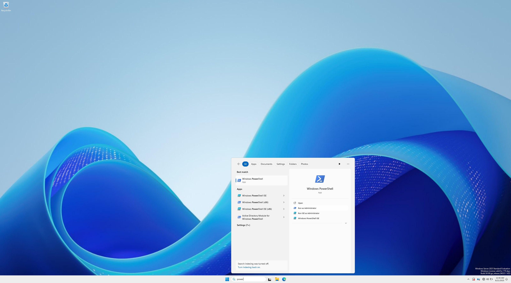
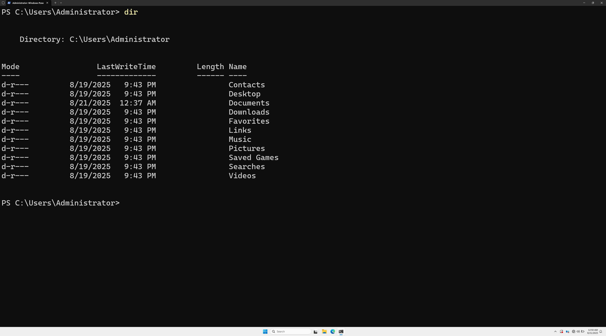
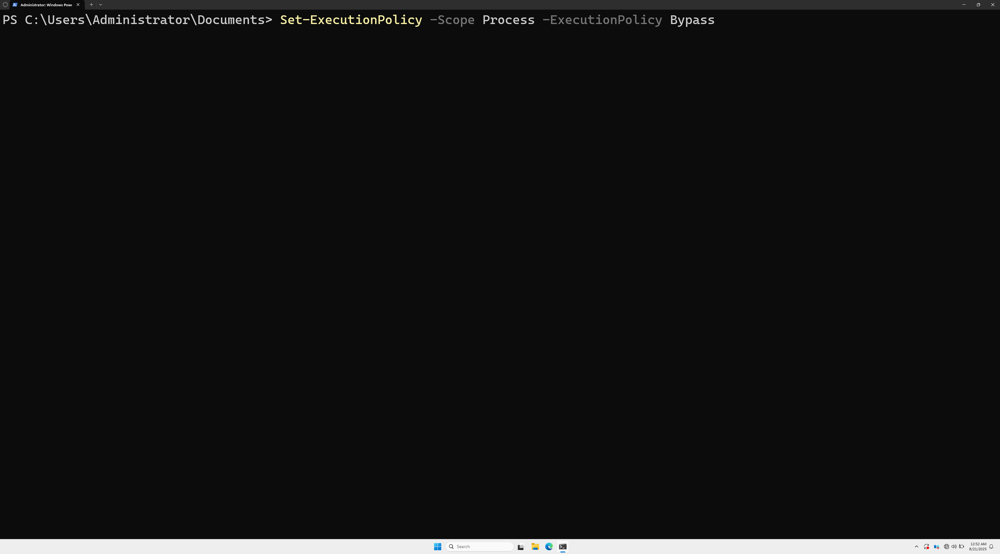
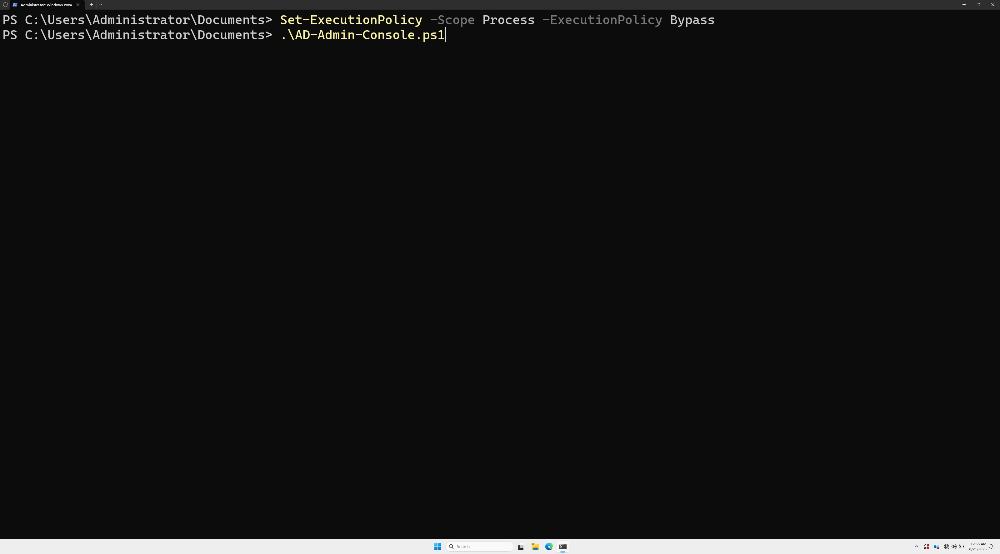
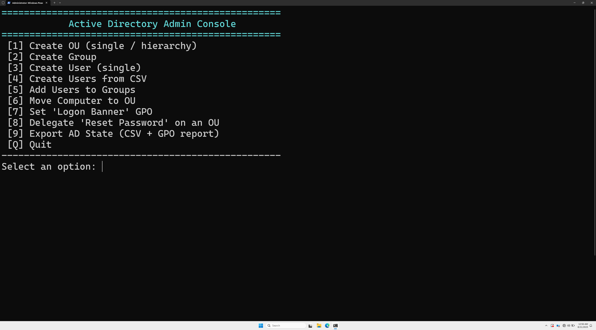
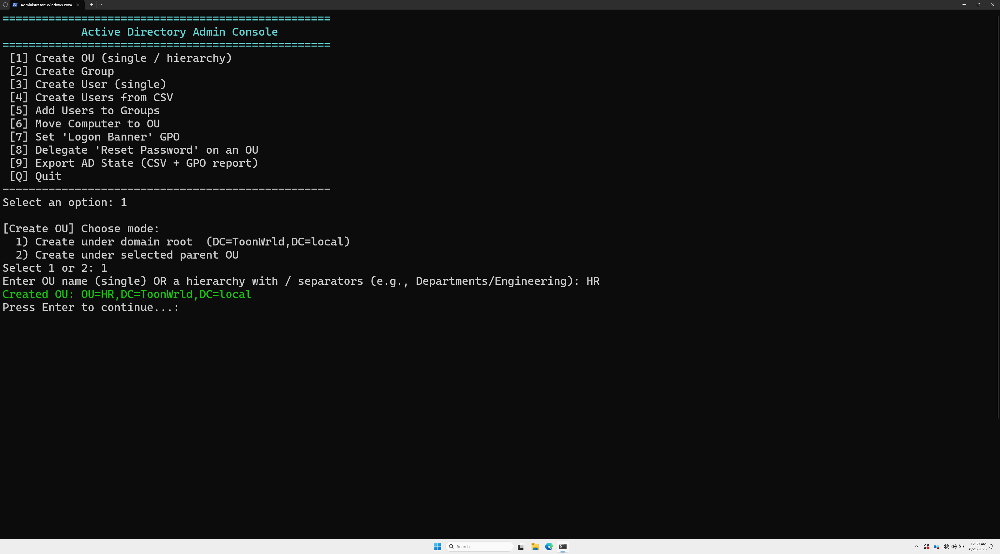
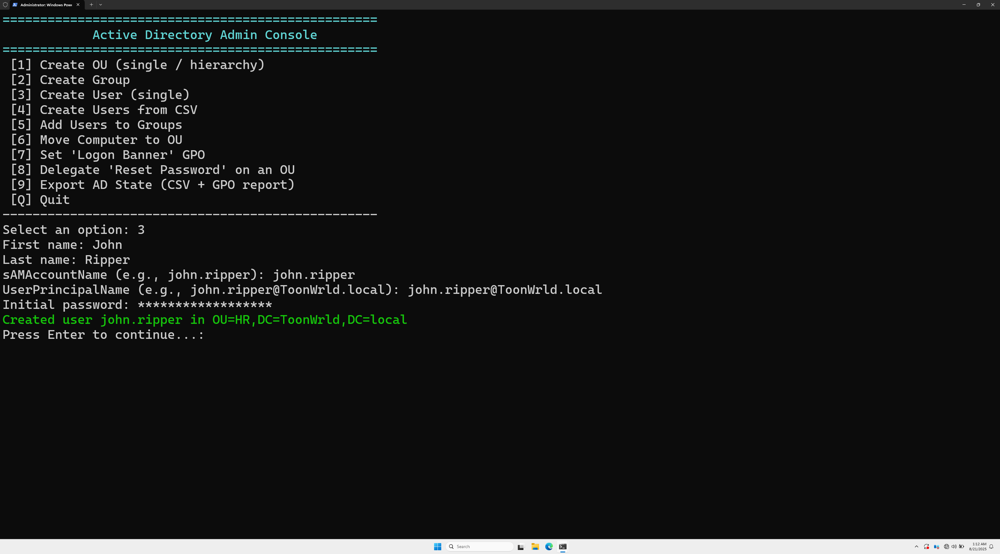

# 🖥️ AD Admin Console Guide

The **AD-Admin-Console.ps1** script is a menu-driven PowerShell tool that automates common Active Directory administration tasks. It’s designed to be beginner-friendly: just run it, pick an option, fill in a few fields, and the console does the rest.

---

## ⚙️ Requirements

- Run from a **domain controller** or RSAT workstation
- Modules:
  - `ActiveDirectory`
  - `GroupPolicy`
- Run **PowerShell as Administrator**

---

## 🚀 How to Launch

1. Open **PowerShell as Administrator**  
   

2. Navigate to the folder containing the script (e.g., `Documents`):  
   ```powershell
   cd "$HOME\Documents"
   dir
   ```  
   

3. Set execution policy for this session:  
   ```powershell
   Set-ExecutionPolicy -Scope Process -ExecutionPolicy Bypass
   ```  
   

4. Run the console:  
   ```powershell
   .\AD-Admin-Console.ps1
   ```  
   

---

## 📜 Console Menu

When launched, the console displays the available options:  


```
 [1] Create OU (single / hierarchy)
 [2] Create Group
 [3] Create User (single)
 [4] Create Users from CSV
 [5] Add Users to Groups
 [6] Move Computer to OU
 [7] Set 'Logon Banner' GPO
 [8] Delegate 'Reset Password' on an OU
 [9] Export AD State (CSV + GPO report)
 [Q] Quit
```

---

## 🧪 Example Workflows

### ➤ Create a new OU
Select option `1`.  
Choose `1` (create under domain root), type `HR`, and press Enter.  


The console confirms when the OU is created.

---

### ➤ Create a new User
Select option `3`.  
An OU picker will appear — choose your OU.  
Fill in the details: First Name, Last Name, `SamAccountName`, `UserPrincipalName`, and initial password.  


The user is created and enabled immediately.

---

## ✅ Notes

- **All other options follow the same pattern**:  
  Select from the menu, enter the required info, press Enter.  
- If the item already exists (OU, group, user), the console will tell you.  
- For CSV bulk user creation, prepare a CSV with columns:  
  `FirstName,LastName,SamAccountName,UPN,OU,InitialPassword,Groups`

---

## 📂 File Layout

```
/scripts/AD-Admin-Console.ps1    # the console script
/scripts/README.md               # this guide
/images/AD-Console/*.png         # screenshots (001–011)
```

---

🎉 That’s it — you now have a simple, repeatable way to perform AD administration tasks in your homelab.
